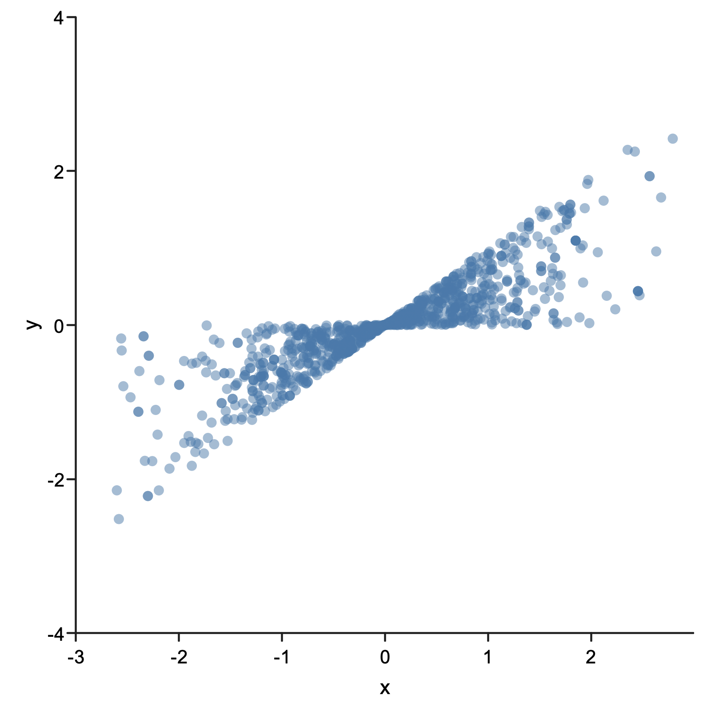

# Rainier mdoc Example

## mdocVariables!

To install Rainier include the following in your `build.sbt`
```scala
libraryDependencies += "com.stripe" % "rainier-core" % "0.3.0-SNAPSHOT"
```

## Imports!

```scala
import com.stripe.rainier.core._
import com.stripe.rainier.sampler._
```

## Silent blocks!

```scala
implicit val rng: RNG = RNG.default

val ys: List[Int] = List(28, 8, -3, 7, -1, 1, 18, 12)
val sigmas: List[Int] = List(15, 10, 16, 11, 9, 11, 10, 18)

def model: Model = {
  val mu = Normal(0, 5).param
  val tau = Cauchy(0, 5).param.abs
  val thetas = 0.until(sigmas.size).map { _ =>
    Normal(mu, tau).param
  }

  thetas.zip(ys.zip(sigmas)).foldLeft(Model.empty) {
    case (m, (theta, (y, sigma))) =>
      Model
        .observe(y.toDouble, Normal(theta, sigma))
        .merge(m)
  }
}
```

## Lots O' Output!

```scala
val sampler: Sampler = HMC(1)
// sampler: Sampler = HMC(1)
val params: Array[Double] = Array.fill(model.parameters.size) { rng.standardUniform }
// params: Array[Double] = Array(
//   0.05384640267610674,
//   0.1946648333984654,
//   0.12207129340428513,
//   0.29007438273119557,
//   0.9011354956253901,
//   0.8842979785182605,
//   0.5987007667802237,
//   0.5577355265527828,
//   0.33105965872644627,
//   0.358602755784468
// )
model.sample(sampler, 1, 2)
// res0: Sample = Sample(
//   List(
//     List(
//       Array(
//         -1.1043114445269095,
//         -0.05089836440862377,
//         -0.8967076753917973,
//         -0.787234245414548,
//         0.3682681343416979,
//         0.27654279017678346,
//         -2.7194102555991786,
//         0.022340076149818814,
//         0.6243237732903995,
//         -0.8092818020703197
//       ),
//       Array(
//         -1.1043114445269095,
//         -0.05089836440862377,
//         -0.8967076753917973,
//         -0.787234245414548,
//         0.3682681343416979,
//         0.27654279017678346,
//         -2.7194102555991786,
//         0.022340076149818814,
//         0.6243237732903995,
//         -0.8092818020703197
//       )
//     )
//   ),
//   Model(
//     List(
//       com.stripe.rainier.compute.Line@17c785bf,
//       com.stripe.rainier.compute.Line@616bead5,
//       com.stripe.rainier.compute.Line@7b0201c6,
//       com.stripe.rainier.compute.Line@4d7be63,
//       com.stripe.rainier.compute.Line@2f96393b,
//       com.stripe.rainier.compute.Line@1195435e,
//       com.stripe.rainier.compute.Line@7af27c9b,
//       com.stripe.rainier.compute.Line@43eff100,
//       Scalar(0.0)
//     )
//   )
// )
```

## Evilplot?

